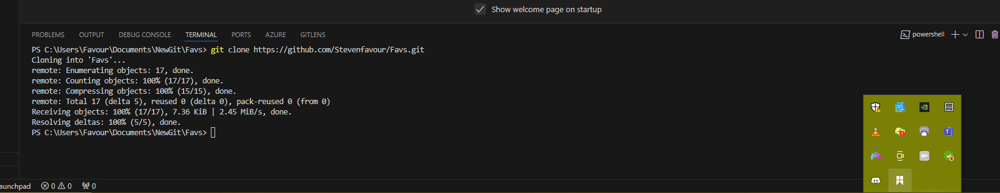
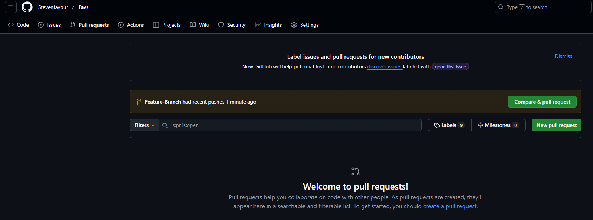
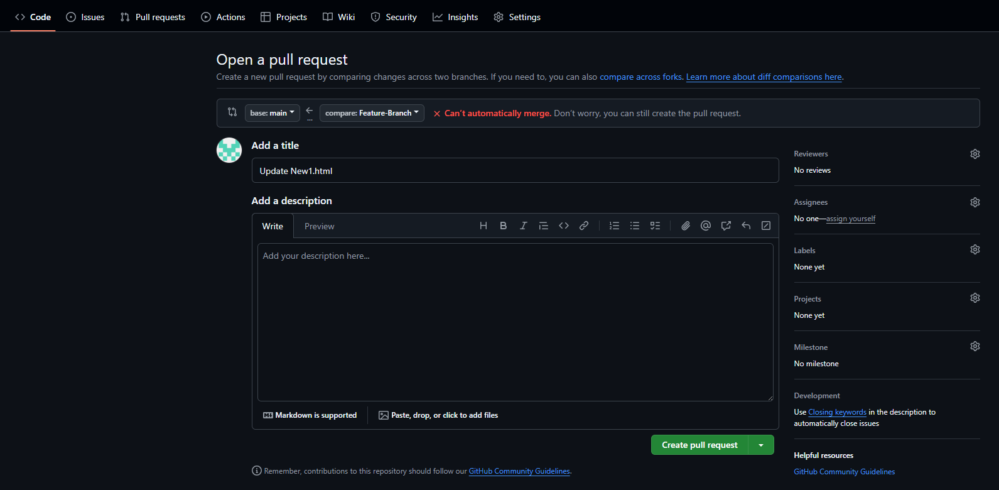
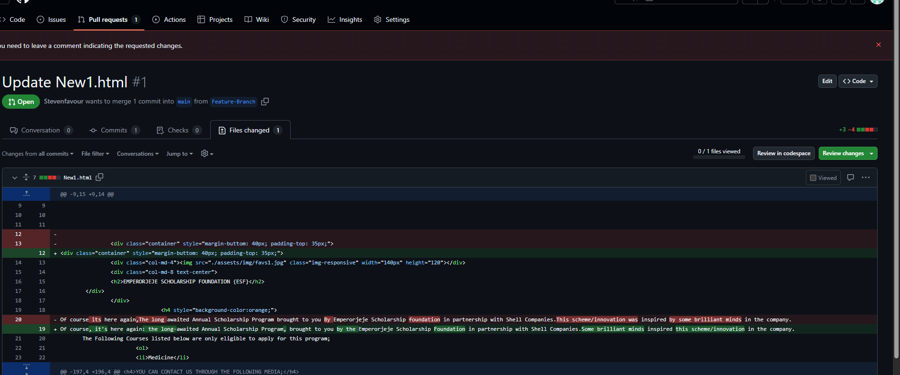

# Mini Version Control System Project.

## 1. Cloning Into Local Machine
Below shows the Git Coomand for cloning the repository from the remote repo into my local environment.

## 2. Pull Request 
The image below shows the notification of a pending request waiting for approval before merging into the main branch.

## 3. Examining Differences betweeen both files

The image below shows the difference between both files where changes were implemented.
